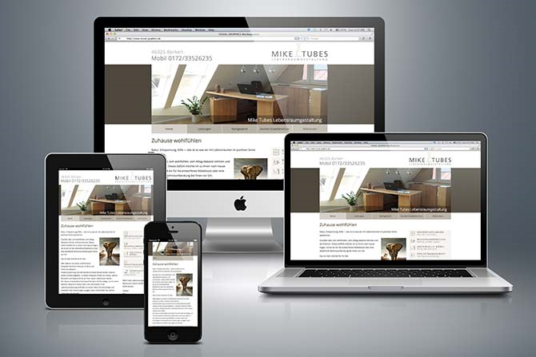

<h1>
USING RESPONSIVE DESIGN
</h1>

	 
	Using responsive design

The next strategy is to create content that adapts to the capabilities of the device on which it is being displayed, known as responsive design. The CSS standard has features that let you change the styling applied to elements based on the capabilities of the device, a technique that is most frequently used to alter the layout of content based on screen width.

<h2>
Creating a responsive header
</h2>
<h2>
Creating a responsive product list
</h2>

CHAPTER 10 - SPORTSSTORE MOBILE
	USING RESPONSIVE DESIGN
	