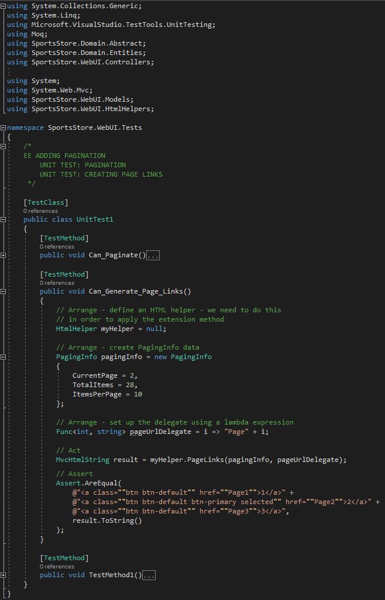

<h1>ADDING PAGINATION</h1>
    You can see in Figure 7-13 that the <b>List.cshtml </b> view displays all the products in the database on a single page. In this section, you'll add support for pagination so that the preview displays a series of products on one page, and the user can move from page to page to view the overall catalog (see Listing 7-16). 
      

     
    <b>Listing 7-16.</b> Adding pagination support to the list action method in the <b>ProductController.cs</b> file

<ul>
    <li>
        <h3><i>UNIT TEST: PAGINATION</i></h3>
        This is the purpose of creating the Unit Test: Compare the <b>Product</b> object with what you would expect from the test data in the simulated implementation. You can see this purpose fullfilled in the <b>UnitTest1.cs</b> file of the <b>SportsStore.UnitTests</b> project implemented below:  
        

             
        

    </li>
    <li>
        <h3><i>Adding the View Model</i></h3>  
        

             
            <b>Listing 7-17.</b> The contents of the <b>PagingInfo.cs</b> file
        

    </li>
    <li>
        <h3><i>Adding the HTML helper method</i></h3>
        <ol>
            <li>In the <b>SportsStore.WebUI</b> project, create a new folder called <b>HtmlHelpers</b></li>
            <li>
                Add a new class file called <b>PagingHelpers.cs</b>  (Listing 7-18).
            </li>
        </ol>  
        

             
            <b>Listing 7-18.</b> The contents of the <b>PagingHelpers.cs</b> file
        

    </li>
    <li>
        <h3><i>UNIT TEST: CREATING PAGE LINKS</i></h3>
        To test the <b>PageLinks </b> helper method, it will call the method with the test data and compare the results to the expected HTML. The unit test method is as follows:  
        

            
        
               
    </li>
    <li>
        <h3><i>Adding the View Model data</i></h3>
        

             
            <b>Listing 7-20.</b> The contents of the <b>ProductsListViewModel.cs</b> file
        
 
        

             
            <b>Listing 7-21.</b> Updating the list method in the <b>ProductController.cs</b> file
        

    </li>
    <li><h3><i>UNIT TEST: PAGE MODEL VIEW DATA</i></h3></li>
    <li><b>Listing 7-22.</b> Updating the list <b>List.cshtml</b> file</li>
</ul>

<h2><i>DISPLAYING THE PAGE LINKS</i></h2>
<ul>
    <li><h3><i>WHY NOT JUST USE A GRIDVIEW?</i></h3></li>
</ul>

<h2><i>IMPROVING THE URLs</i></h2>
<ul>
    <li><b>Listing 7-24.</b> Adding a new route to the <b>RouteConfig.cs</b> file</li>
    <li><b>Figure 7-15.</b> The new URL scheme displayed in the browser</li>
</ul>