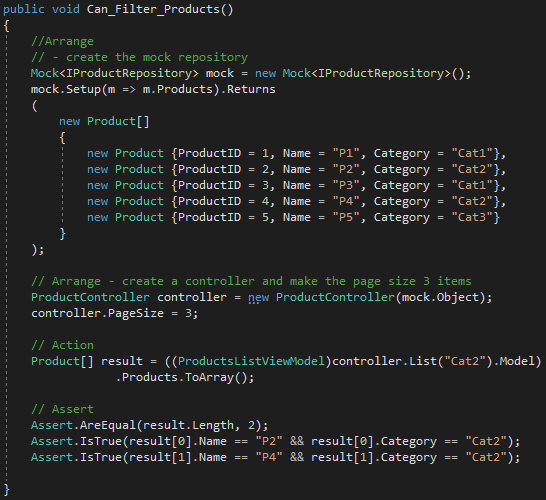

    In the previous chapter, the core infrastructure of the <b>SportsStore </b> application was configured. This infrastructure will now be used to add features to the application.    

<h1><i>ADDING NAVIGATION CONTROLS</i></h1>
    This section is divided into three phrases: 
    <ol>
        <li>
            Enhance the <b>List</b> method in the <b>ProductController</b> class so that it is able to filter the <b>Product</b> objects in the repository
        </li>
        <li>
            Revisit and enhance the URL scheme and revise the routing strategy
        </li>
        <li>
            Create category list that will go into the sidebar of the site, highlighting the current category and linkings to others.
        </li>                
    </ol>

<h2><i>FILTERING THE PRODUCT LIST</i></h2>
    <ul>
        <li>
            Let's start with the view model class <b>ProductListViewModel</b> in the <b>SportsStore.WebUI</b> project
        </li>
        <li>
            It is necessary to communicate the current category to the view in order to render the sidebar
        </li>
        <li>
            You can see this implementation in Listing 8-1, in the code below:
            

                 
                <b>Listing 8-1.</b> Enhancing the <b>ProductsListView.cs</b> file
            

        </li>
        <li>
            The next step is to update <b>List</b> action method from the <b>ProductController</b> class. This update brings these features:
            <ol>
                <li>
                    The <b>List</b> action method will filter <b>Product</b> object by category
                </li>
                <li>
                    With the new property added to the view template it will be possible to define the category that was selected
                </li>
            </ol>
        </li>
        <li>
            You can see the implementation in Listing 8-2, in the code below:
            

                 
                <b>Listing 8-2.</b> Adding category support to the List action method in the ProductController.cs file
            

        </li>
        <li>
            <h3><i>UNIT TEST: UPDATING EXISTING UNIT TESTS</i></h3>
                <ul>
                    <li>
                        The signature of the List action method has changed and you need to sync the unit tests with the changed code
                    </li>
                    <li>
                        The methods you need to change are <b>Can_Paginate</b> and <b>Can_Send_Pagination_View_Model</b> test. The code below shows the point you need to change: 
                            ... 
                            <i>
                            ProductsListViewModel result = 
                            <b>(ProductsListViewModel) controller.List(null, 2).Model;</b>
                            </i> 
                            ...
                    </li>        
                </ul>
        </li>
        <li>
            With these small changes it's possible to see the result in practice. Run the application, type <b><i>/category=Soccer</i></b> at the end of the URL, for example: <i>http://localhost:xxxxx/?category=Soccer</i>. The result you will see in <b>Figure 8-1</b> in the picture below:
            

                 
                <b>Figure 8-1.</b> Using the query string to filte by category
            

        </li>
        <li>
            <h3><i>UNIT TEST: CATEGORY FILTERING</i></h3>
            It's necessary to test whether the filtering function works correctly, here is the test:
            

                
            

        </li>
    </ul>    

<h2><i>REFINING THE URL SCHEME</i></h2>
<ul>
    <li>
        We need a different approach to avoid seeing and using URL's like <b>/?category=Soccer</b>. To implement the new scheme, you must to change the <b>RegisterRouter</b> method in the <b>App_Start/RouterConfig.cs</b>file, as shown in Listing 8-3.
        

             
            <b>Listing 8-3.</b> The new URL scheme in the <b>RouteConfig.cs</b> file
        

    </li>
    <li>
        Now, you need updating the <b>list.cshtml</b> file and pass the information to the helper method, as shown in Listing 8-4.
        

             
            <b>Listing 8-4.</b> Adding category information to the pagination links in the List.cshtml file
        

    </li>
</ul>

<h2><i>BUILDING A CATEGORY NAVIGATION MENU</i></h2>
<ul>
    <li>
        In this section, we'll implement a way for the customer to select a category without typing URLs. To make this possible, we will introduce a concept called <b>child actions</b> for creating items as a reusable navigation control
    </li>
    <li>
        The most important characteristc of the <b>child action</b> is self-contained and reusable. But what's the <b>child action</b>? The <b>child action</b> is a controller that, through its methods renders any dynamic HTML in anywhere in the View. To render any HTML in anywhere you need to use HTML Helper method called <b>Html.Action</b>  
    </li>
    <li>
        <h3><i>CREATING THE NAVIGATION CONTROLLER</i></h3>
        <ol>
            <li>
                In the <b>SportsStore.WebUI</b> project create a new Controller called <b>NavController</b> and implement the action method called <b>Menu</b>, as shown in Listing 8-5.
                

                     
                    <b>Listing 8-5</b>. Adding the Menu action method to the NavController.cs file
                

            </li>
            <li>
                Now time to integrate the child action into the rest of the application. Edit the <b>Views/Share/_Layout.cshtml</b> so that it calls the <b>Html.Action</b> helper method, as shown in Listing 8-6.
                

                     
                    <b>Listing 8-6</b>. Adding the render action call to the _Layout.cshtml file
                

            </li>            
        </ol>
    </li>
</ul>

<h2><i>Correcting the Page Count</i></h2>