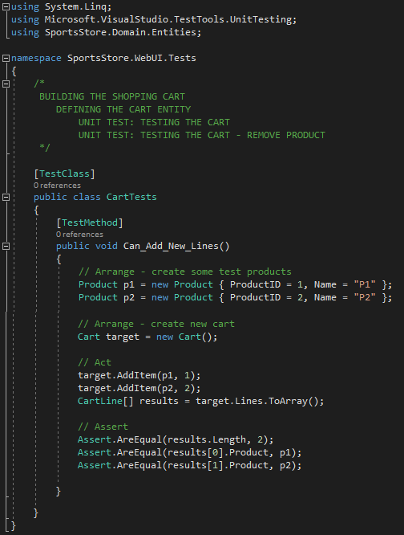

<h1><i>BUILDING THE SHOPPING CART</i></h1>

	Despides the progress, the application cannot sell any products until I implement a shopping cart. In this section, will be created the shopping cart experience.

<h2><i>DEFINING THE CART ENTITY</i></h2>
<ul>
	<li>
		Create a class file called Cart.cs to the Entities folder in the SportsStore.Domain project (Listing 8-12).
		

			 
			<b>Listing 8-12.</b> Cart and CartLine Classes in the Cart.cs File
		

	</li>
	<li>
		<h3><i>UNIT TEST</i></h3>
		<ol>
			<li>
				<b>TESTING THE CART</b> - Create a new unit test file in the SportsStore.UnitTests project called CartTests.cs to test, in the first moment, the add an item to the cart behavior (see the code below). 
				

					 
					<i>UNIT TEST - TESTING THE CART</i>
				
 				
			</li>
			<li>
				<b>ADD QUANTITY FOR EXISTING LINE</b> - After you have added items to the car, it's necessary to increment the quantity of the corresponding CarLine and not create a new one. Here is the test: 
				

					 
					<i>UNIT TEST - ADD QUANTITY FOR EXISTING LINE</i>
				
 
			</li>
			<li>
				<b>REMOVE PRODUCT</b> - In this step, the feature to remove products from cart will be implemented. This feature is implemented by the RemoveLine method in the code below: 
				

					 
					<i>UNIT TEST - REMOVE PRODUCT</i>
				
 	
			</li>
			<li>
				<b>CALCULATE THE TOTAL</b> - The next behavior i want to test is the ability to calculate the total cost of the items in the cart. here’s the test for
				this behavior: 
				

					 
					<i>UNIT TEST - CALCULATE THE TOTAL</i>
				
 
			</li>
			<li>
				<b>CLEAR CONTENTS OF THE CART</b> - The final test is simple -> to ensure that the contents of the cart are properly removed when reset. here is the test: 
				

					 
					<i>UNIT TEST - CLEAR CONTENTS OF THE CART</i>
				
 
			</li>
		</ol>
	</li>
</ul>

<h2><i>ADDING THE ADD TO CART BUTTONS</i></h2>
<ul>
	<li>AAA</li>
	<li>AAA</li>
</ul>

<h2><i>IMPLEMENTING THE CART CONTROLLER</i></h2>
<ul>
	<li>AAA</li>
	<li>AAA</li>
</ul>

<h2><i>DISPLAYING THE CONTENTS OF THE CART</i></h2>
<ul>
	<li>AAA</li>
	<li>AAA</li>
</ul>
	
	
	
	
  
