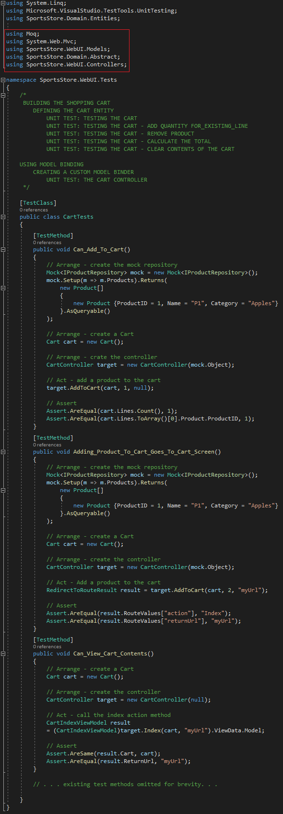

<h1>
	
CHAPTER 9 - SPORTSSTORE - COMPLETING THE CART

</h1>

	In this chapter, the implementation of the SportsStore app will continue

<h1><i>USING MODEL BINDING</i></h1>

	 
	Model Binding

&nbsp;&nbsp;&nbsp;&nbsp;ASP.NET MVC model binding is a process for automatically converting HTTP requests into objects that are passed to an action method parameters. Model binding, as an abstraction layer, simplifies this entire conversion process. In this section wil be implemented a custom model binder to improve the CartController class, taking the Cart object contained in the session data and passing them as parameters to the action method in the CartController class.

<ul>
	<li>
		<h2><i>CREATING A CUSTOM MODEL BINDER</i></h2>
		To implement custom model using the <i>System.Web.Mvc.IModelBinder</i> interface follow these steps:
		<ol>
			<li>Added a new folder in the <i>SportsStore.WebUI</i> project inside the folder <i>Infrastructure</i> called <i>Binders</i></li>
			<li>Create a <i>CartModelBinder.cs</i> class inside it</li>
			<li>
				Implement the <i>CartModelBinder.cs</i> class shows in the code below (Listing 9-1)
				

					 
					<b>Listing 9-1.</b> The Contents of the CartModelBinder.cs File
				
 
			</li>
			<li>
				Now it's necessary to tell MVC Framework that it can use the <i>CartModelBinder</i> class to create instances of <i>Cart</i>. To do this, open the <i>Glogal.asax.cs</i> file and combine as shown in the code below.
				

					 
					<b>Listing 9-2.</b> Registering the CartModelBinder Class in the Global.asax.cs File
				
 
			</li>
		</ol>
	</li>
	<li>
		Now it's time to update the <i>Cart</i> controller to remove the <i>GetCart</i> method and rely on the model binder to provider the controller with <i>Cart</i> objects. Listing 9-3 shows the changes.
		

			 
			<b>Listing 9-3.</b> Relying on the Model Binder in the CartController.cs File
		
 		
	</li>
	<li>
		<h3><i>UNIT TEST: THE CART CONTROLLER</i></h3>
		Here are the unit tests that were added to the <i>CartTests.cs</i> file in the <i>SportsStore.UnitTests</i> project:
		

				 
				Unit test: the cart controller
		
 		
	</li>
</ul>

USING MODEL BINDING
	CREATING A CUSTOM MODEL BINDER
		UNIT TEST: THE CART CONTROLLER
	
