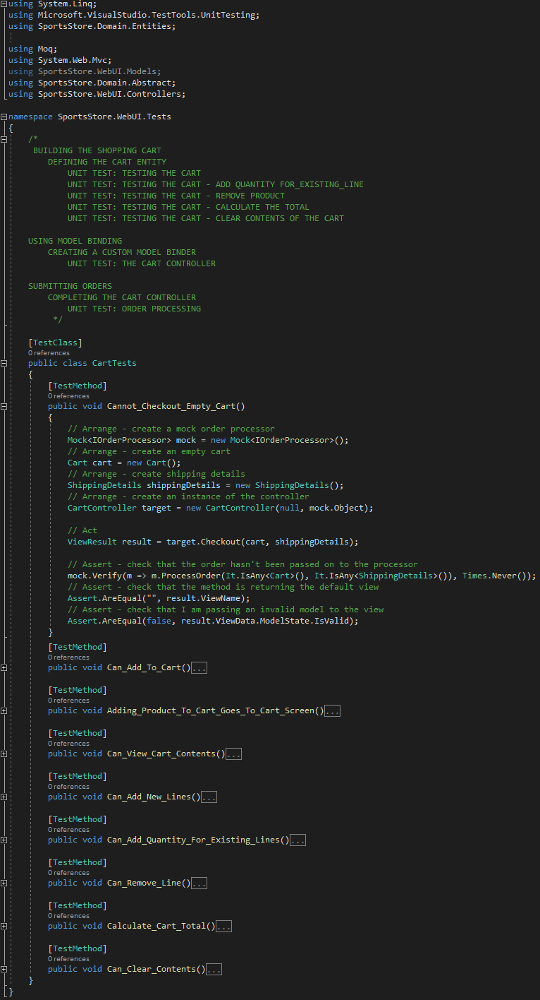
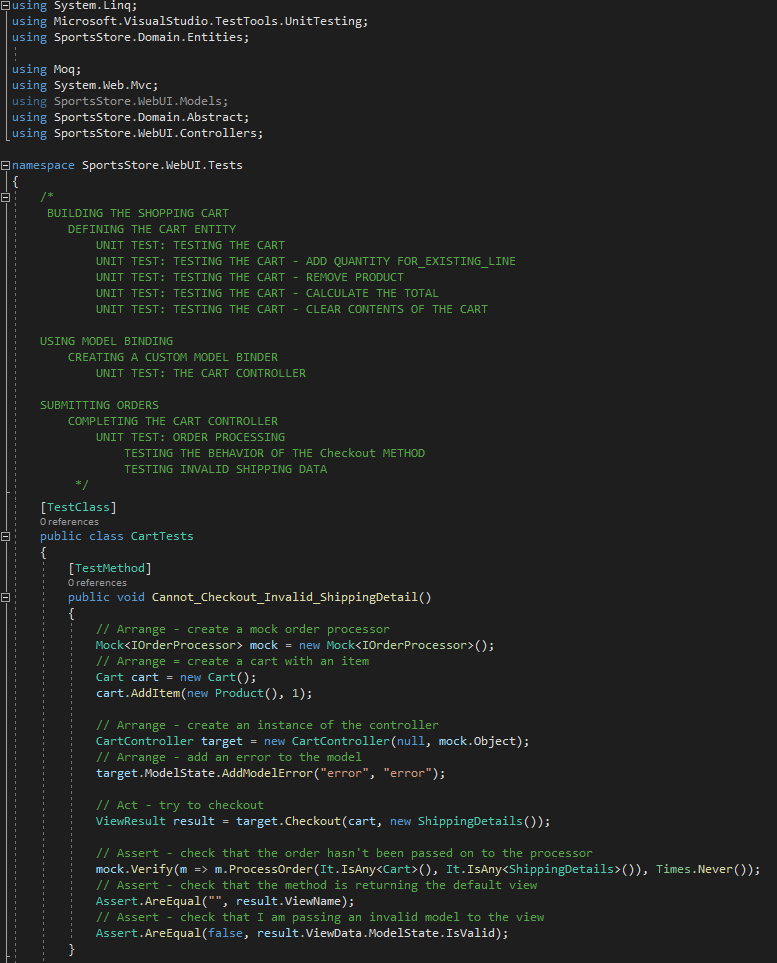
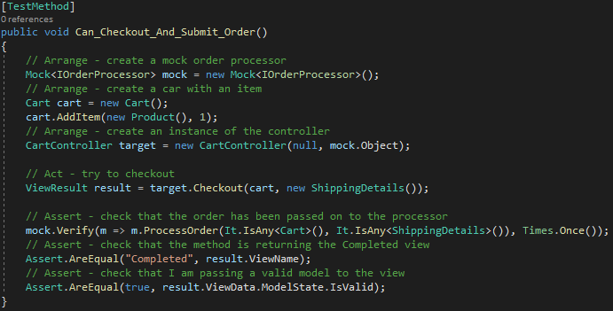

<h1>
SUBMITTING ORDERS
</h1>

	

<h4>The SportsStore web app has these two features:</h4>
&nbsp;&nbsp;&nbsp;&nbsp;1 - the mechanism to pay for the things you are buying (check out) 
&nbsp;&nbsp;&nbsp;&nbsp;2 - Complete an order  

<h4>Now in this section we will do the following tasks:</h4>
&nbsp;&nbsp;&nbsp;&nbsp;1 - Extend the domain model to provide support for capturing the shipping details from a user 
&nbsp;&nbsp;&nbsp;&nbsp;2 - Add the application support to process those details 

<h2>
EXTENDING THE DOMAIN MODEL
</h2>
&nbsp;&nbsp;&nbsp;&nbsp;Create a file called <b>ShippingDetails.cs</b>, and put in the <b>Entities</b> folder in <b>SportsStore.Domain</b> project, and edit to match as in <b>Listing 9-8</b>

	 
	<b>Listing 9-8.</b> The Contents of the ShippingDetails.cs File

<h2>
ADDING THE CHECKOUT PROCESS
</h2>
<ul>
	<li> 
		Open the <b>Index.cshtml</b> file in <b>Views/Cart</b>, to add the <b>checkout button</b> to the cart summary view (Listing 9-9).
		

			 
			<b>Listing 9-9.</b> The Contents of the ShippingDetails.cs File
		
 
		Run the web app and see the result:
		

			 
			<b>Figure 9-3.</b> The Checkout now button
		

	</li>
	<li>
		In Listing 9-10, we will implement the <b>checkout</b> method in the <b>CartController</b> class, as shown in the picture below
		

			 
			<b>Listing 9-10.</b> The Checkout Action Method in the CartController.cs File
		

	</li>
	<li>
		Now create the view for the action method called <b>Checkout</b>, edit to match Listing 9-11.
		

			 
			<b>Listing 9-11.</b> The Contents of the Checkout.cshtml File
		

	</li>
	<li>
		Run the web app and see the result in the picture below:
		

			 
			<b>Figure 9-4.</b> The shipping details form
		

	</li>
	<li>
		<h3><i>REDUCING DUPLICATION IN THE Checkout.cshtml FILE</i></h3>
		<ol>
			<li>
				The problem with this view is that it contains a lot of repeated markup, the Listing 9-12 shows how to reduce the repeated markup:
				

					 
					<b>Listing 9-12.</b> Reducing Duplication in the Checkout.cshtml File
				

			</li>
			<li>
				Run the example and look at the output generated by the view (Figure 9-5).
				

					 
					<b>Figure 9-5.</b> The problem with generating labels from property names
				

			</li>
			<li>
				<i>SETTING A <b>DisplayName</b> PROPERTY</i> 
				Property name doesn't give good labels this is a problem. This is why I check to see if there is a DisplayName value available when I generate the form elements, like this:
				

					 
					<b>Figure 9-A.</b> Display value
				

				To take advantage of the DisplayName property, you need to apply the Display attribute to the model class, as shown in Listing 9-13.
				

					 
					<b>Listing 9-13.</b> Applying th e Display attribute to the ShippingDetails.cs File
				

			</li>
			<li>
				Run the application and see the effect of the Display attribute on the model type:
				

					 
				<b>Figure 9-6.</b> The effect of the Display attribute on the model type
			</li>
		</ol>
	</li>
</ul>	

<h2>
IMPLEMENTING THE ORDER PROCESSOR
</h2>
<ul>
	<li>
		<i>DEFINING THE INTERFACE</i> 
		Add a new interface called <b>IOrderProcessor</b> to the Abstract folder of the <b>SportsStore.Domain</b> project and edit the contents so that they match Listing 9-14.
		

			 
			<b>Listing 9-14.</b> The Contents of the IOrderProcessor.cs File
		

	</li>
	<li>
		<i>IMPLEMENTING THE INTERFACE</i> 
		Create a new class file called EmailOrderProcessor.cs in the Concrete folder of the SportsStore.Domain project and edit the contents so that they match Listing 9-15. This class uses the built-in SMTP support included in the .NET Framework library to send an e-mail.
		

			 
			<b>Listing 9-15.</b> The Contents of the EmailOrderProcessor.cs File
		

	</li>
</ul>

<h2>
REGISTERING THE IMPLEMENTATION
</h2>
<ul>
	<li>
	Implemented the <b>IOrderProcessor</b> interface, now we need to instantiate using Ninject. Edit the <b>NinjectDependencyResolver.cs</b> file in the <b>Infrastructure</b> folder (SportsStore.WebUI project) and make the changes shown in Listing 9-16 to the <b>AddBindings</b> method.
		

			 
			<b>Listing 9-16.</b> Adding Ninject Bindings for IOrderProcessor to the NinjectDependencyResolver.cs File
		

	</li>
	<li>
		Setting the <b>ConfigurationManager.AppSettings</b> property (used in Listing 9-16) in the <b>Web.config</b>, which are shown in Listing 9-17.
		

			 
			<b>Listing 9-17.</b> Application Settings in the Web.config File
		

	</li>
</ul>

<h2>
COMPLETING THE CART CONTROLLER
</h2>
To complete the <b>CartController</b> class, you need to modify the constructor so that it demands an implementation of the <b>IOrderProcessor</b> interface and add a new action method that will handle the HTTP form POST request when the user clicks the Complete order button. Listing 9-18 shows both changes.

	 
	<b>Listing 9-18.</b> Completing the Controller in the CartController.cs File

 

<h2>
UNIT TEST: ORDER PROCESSING
</h2>
<ol>
	<li>
		<h3><i>TESTING THE BEHAVIOR OF THE <b>Checkout</b> METHOD</i></h3>
		It's necessary to test the behavior of the overloaded version of the <b>Checkout</b> method (<b>CartController</b> in <b>SportsStore.WebUI.Controllers</b>). The behaviors that will be tested are: 1 - There are item in the cart; 2 - The customer has provided valid shipping details. This test ensures that i cannot check out with an empty cart! Here is the first test method:
		

			 
			<i>Testing the behavior of the the Checkout method</i>
		

	</li>
	<li>
		<h3><i>TESTING INVALID SHIPPING DATA</i></h3>
		the next test method injects an error into the view model to simulate a problem reported by the model binder (which would happen in production when the customer enters invalid shipping data):
		

			 
			<i>Testing the invalid shipping data</i>
		

	</li>
	<li>
		<h3><i>TESTING THE PROCESS ORDERS</i></h3>
		Here is the test:
		

			 
			<i>Testing the process orders</i>
		

	</li>
</ol>

<h2>
DISPLAYING VALIDATION ERRORS
</h2>
The MVC Famework uses validation attributes applied in the ShippingDetails (Listing 9-8) class to validate user data input. To enable validation of user data input we need to follow these steps:
<ol>
	<li>
		To display a summary of the validation erros, the helper method Html.ValidationSummary helper we will be used method applied in the Checkout.cshtml view (Listing 9-19)
		

			 
			<b>Listing 9-19</b>. Adding a Validation Summary to the Checkout.cshtml File
		

	</li>
	<li>
		The next is to create CSS styles that target the classes used by the validation summary. Create the file called ErrorStyle.css in the Content folder of the SportsStore.WebUI project as shown in Listing 9-20.
		

			 
			<b>Listing 9-20</b>. The Contents of the ErrorStyles.css File
		

	</li>
	<li>
		Now, add a link element for ErrorStyles.css in the _Layout.cshtml file, as shown in Listing 9-21.
		

			 
			<b>Listing 9-21</b>. Adding a Link Element in the _Layout.cshtml File
		

	</li>
	<li>
		With these changes, validation errors are reported through highlighting problematic fields and by showing a
		summary of problems, as Figure 9-7 illustrates.
		

			 
			<b>Figure 9-7</b>. Displaying validation messages
		

	</li>
</ol>

<h2>
DISPLAYING A SUMMARY PAGE
</h2>
	In this section we will complete the checkout process, show customers the order confirmation and show them the "Thank you" page ending the process. 
<ul>
	<li>
		 Create a file called Completed.cshtml in Views/Cart, edit it to match in Listing 9-22.
		

			 
			<b>Listing 9-22</b>. The Contents of the Completed.cshtml File
		

	</li>
	<li>
SUBMITTING ORDERS	
	DISPLAYING A SUMMARY PAGE 254
		Figure 9-8. The thank-you page	
	</li>
</ul>