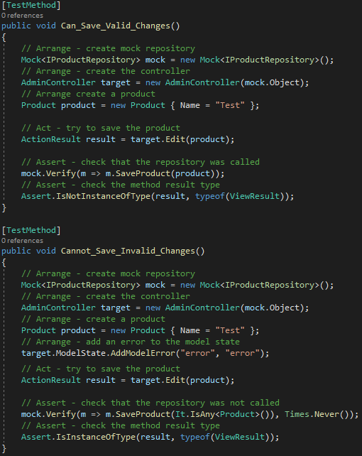

 <h1 align="center">
    CHAPTER 11 - SPORTSSTORE - ADMINISTRATION
</h1>

In this chapter, we will add new features to the SportsStore application that will make it possible to manage the product catalog. These are the features that will be implemented in this chapter:
1. Create, read, update and delete (CRUD) product repository item.
2. Uploading and displaying images alongside products in the catalog.

## ADDING CATALOG MANAGEMENT
* CREATING A CRUD CONTROLLER  
    * To start this journey we will create a new controller (*SportsStore.WebUI project*) for the SportsStore administration by following these steps:
        1. Right-click on the Controllers folder. 
        2. Select *Add > Controller* from the pop-up menu.
        3. Select *MVC 5 Controller – Empty* from the list of options, click add button.
        4. Set the name to *AdminController*, click add button.
        5. Edit the content to match with the Listing 11-1.
            <p align="center">
                <br />
                <b>Listing 11-1.</b> The Contents of the AdminController.cs File
            </p>        

    * The controller constructor declares a dependency on the IProductRepository interface, which Ninject will resolve when instances are created

    * UNIT TEST: THE INDEX ACTION  
        * The focus in this test will be on the index method (AdminController.cs) if it correctly returns the Products objects from the repository. 
        * The test will work like this:
            1. Creating a mock repository
            2. Comparing the test data with the data returned by action method.
        * Create a new test file (*SportsStore.UnitTests* project) called *AdminTests.cs*, edit the content to match with the Listing 11-1A.
            <p align="center">
                <br />
                <b>Listing 11-1A.</b> The Contents of the AdminTests.cs File
            </p>        

* CREATING A NEW LAYOUT
    * A simple layout will be created for the administration views to apply changes to the product catalog.
    * To create the administration views, follow these steps:
        1. Right-clicking the *Views/Shared* folder in the *SportsStore.WebUI* project
        2. Select *Add > MVC 5 Layout Page (Razor)* from pop-up menu
        3. Set the name to *_AdminLayout.cshtml*
        4. Click the *OK* button to create the file        
    * Set the contents of the new view to match *Listing 11-2*.
        <p align="center">
            <br />
            <b>Listing 11-2.</b> The Contents of the _AdminLayout.cshtml File
        </p>  

* IMPLEMENTING THE LIST VIEW
    * Once created a new layout, it's time to implement a view that corresponds to the *Index* action method of the *AdminController* class
    * To use the *Visual Studio scaffold* follow these steps:
        1. Right-click on the *View/Adimn* folder (*SportsStore.WebUI project*).
        2. Select *Add > View* from the menu.
        3. Select *MVC 5 View* and click the *Add* button
        4. Set all configuration to match *Figure 11-2* and click the *Add* button 
            <p align="center">
                <br />
                <b>Figure 11-2.</b> Configuring a scaffold view
            </p>  
    * In *Listing 11-3* you can see the content of the *Index.cshtml* file
        <p align="center">
            <br />
            <b>Listing 11-3.</b> The Contents of the <i>Views/Admin/Index.cshtml</i> File
        </p>
    * Run the web application and add */Admin/Index* to the URL. Figure 11-3 shows the results.
        <p align="center">
            <br />
            <b>Figure 11-3.</b> Rendering the scaffold List view
        </p>
    * Returning to the do-it-yourself approach, edit the *Index.cshtml* file so that it corresponds to Listing 11-4.
        <p align="center">
            <br />
            <b>Listing 11-4.</b> Modifying the <i>Index.cshtml</i> View
        </p>
    * You can see how this view renders in Figure 11-4    
        <p align="center">
            <br />
            <b>Figure 11-4.</b> Rendering the modified Index view
        </p>

* EDITING PRODUCTS
    * CREATING THE EDIT ACTION METHOD  
        Adding the edit action method in the AdminController.cs file, as you can see in the Listing 11-5.
        <p align="center">
            <br />
            <b>Listing 11-5.</b> Adding the Edit Action Method in the AdminController.cs File
        </p>

        * UNIT TEST: THE EDIT ACTION METHOD
            * This test method will check two behaviors in the Edit action method:  
                1. Getting the product by providing the ID value to edit the expected product.  
                2. Do not get any product if the given id value is not in the repository.
            * Open the *AdminTests.cs* file and edit it to match Listing 11-5A 
                <p align="center">
                    <br />
                </p>

    * CREATE THE EDIT VIEW
        * Now we have an action method, time to create a view for it to render:
            1. Right-click on the *View/Admin* folder.
            2. Select *Add > MVC 5 View Pagae (Razor)*.
            3. Set the name to *Edit.cshtml*.
            4. Click the button to create the file and edit the contents to match *Listing 11-6*.
                <p align="center">
                    <br />
                    <b>Listing 11-6.</b> The Contents of the Edit.cshtml File
                </p>

        * As you saw in *Lising 11-6*, was used *@Html.EditorForModel()* helper which returns an HTML input element for each property in the model, in this case *Product class*. Run the application and navigate to /Admin/Index, click one of the product name links, and you see the page shown in Figure 11.5.
            <p align="center">
                <br />
                <b>Figure 11-5.</b> The page generated using the EditorForModel helper method
            </p>  

        * We can influence the output of the *Html.EditorForModel* using *model metadata*. Listing 11-7 shows how to use metadata on the Product class in the SportsStore.Domain project.   
            <p align="center">
                <br />
                <b>Listing 11-7.</b> Using Model Metadata in the Product.cs File
            </p>

        * Run the web application, add */Admin/Edit?ProductID=1* to the URL and see the effect of the metadata on the fields (Figure 11-6).
            <p align="center">
                <br />
                <b>Figure 11-6.</b> The effect of applying metadata
            </p>  

        * Open the *Edit.cshtml* file edit it to match with the contents of Listing 11-8.
            <p align="center">
                <br />
                <b>Listing 11-8.</b> Updating the Edit.cshtml File
            </p>
        
        * You can see how this view is displayed in the browser in Figure 11-7.
            <p align="center">
                <br />
                <b>Figure 11-7.</b> Displaying the editor page for products
            </p>  
        

    * UPDATING THE PRODUCT REPOSITORY
        * Before implementing the save method (*Figure 11-7*), you need to add a new method to the ProductRepository (*SportsStore.Domain project*), as shown in Listing 11-9
            <p align="center">
                <br />
                <b>Listing 11-9.</b> Adding a Method to the IProductRespository.cs File
            </p>  

        * Now time to implement the SaveProduct in the EFProductRepository.cs file using Entity Framework as shown in Listing 11-10
            <p align="center">
                <br />
                <b>Listing 11-10.</b> Implementing the SaveProduct Method in the EFProductRepository.cs File
            </p>  


    * HANDLING EDIT POST REQUESTS
        1. We can make the <i>Save</i> button work by implementing the overload <i>Edit</i> action method of the <i>AdminController</i> class. The new method is shown in Listing 11-11.  
            <p align="center">
                <br />
                <b>Listing 11-11.</b> Adding the POST-Handling Edit Action Method in the AdminController.cs File
            </p>

            Here are some points we need to see about the code shown in Listing 11-11:
            * The *model binder* is able to validate the submitted data by reading its values using the *ModelState.IsValid* property. If the model binder validation is correct, all changes are saved to the repository, the Index action method is invoked and the user accesses the list of products. Otherwise, any problems with the data, *Edit* view is called again for the user make the corrections.
            * After changes saved to the repository, message is stored to the *TempData* feature. The *TempData* feature is a key/value dictionary similar to the Session data and *ViewBag* features. The most important difference from Session data is the TempData is deleted when the HTTP request ends.
            * Notice that it was the ActionResult type returned from Edit method, ViewResult type has been used so far. ViewResult (ViewResult is derived from ActionResult) is used to render a View.
            * *RedirectToAction* is a method used to redirect to a different action method in the same controller or in a different controller. When this RedirectToaction is invoked, it returns the *HTTP response status code 302 found* to the browser, terminating the original request. In the next step, the browser will make a GET response to the specified action method in the same controller or in a different controller. [[1]](https://www.c-sharpcorner.com/blogs/difference-between-return-view-return-redirect-return-redirecttoaction-and-redirecttoroute-in-mvc) [[2]](https://www.devmedia.com.br/asp-net-mvc-como-criar-redirecionamentos-para-urls-internas-e-externas/37807) [[3]](https://www.dotnettricks.com/learn/mvc/return-view-vs-return-redirecttoaction-vs-return-redirect-vs-return-redirecttoroute) [[4]](https://cursos.alura.com.br/forum/topico-quando-usar-return-view-e-return-redirecttoaction-40880) [[5]](https://stackoverflow.com/questions/2315048/whats-the-difference-in-asp-net-mvc-of-redirecttoroute-and-redirecttoaction) [[6]](https://en.wikipedia.org/wiki/HTTP_302)
            * ViewBag property cannot be used in the redirect context as it is available for the current request, after the request is completed Viewbag property becomes Null. In the case of Session property, it persists for its expiration time. That's why the TemData property fits, your data will persists long enough to read it even in a different request, We will see that in Listing 11-12.  

        2. *UNIT TEST: EDIT SUBMISSIONS*  
            For the post-process edit action method, it is necessary to check whether valid or invalid updates are passed to the repository of the product to be saved. Here are the test methods:
                <p align="center">
                    
                </p>  

    * DISPLAYING A CONFIRMATION MESSAGE
        * It's time to use the message stored in *TempData* in the *_AdminLayout.cshtml* file. *Listing 11-12* shows the change to the file
            <p align="center">
                <br />
                <b>Listing 11-12.</b> Handling the TempData Message in the _AdminLayout.cshtml File
            </p>

        * Run the application using the Admin/Index URL, choose a product to edit and click the *Save* button. The TempData message will be   displayed, as shown in Figure 11-8. 
            <p align="center">
                <br />
                <b>Figure 11-8.</b> Editing a product and seeing the TempData message
            </p>

    * ADDING MODEL VALIDATION
        * As is the case for most project, it's necessary add validation rules to the model entity. t the moment, the user is allowed to enter invalid data, and the application tries to store that data in the database. In Listing 11-13, data annotations applied to the Product class for data validation.
            <p align="center">
                <br />
                <b>Listing 11-13.</b> Applying Validation Attributes to the Product.cs File
            </p>

        * The *Html.TextBox* and *Html.TextArea* (Edit.cshtml) was used to create the input and textarea elements signal validations problems. These signals are sent using the *Content/ErrorStyles.css* file highlighting problems. It is necessary to provide the user details of any problems, and you can see this in Listing 11-14
            <p align="center">
                <br />
                <b>Listing 11-14.</b> Adding Validation Messages to the Edit.cshtml File
            </p>

        * *Figure 11-9* shows how the validation messages appear when you edit a product and enter data that breaks the rules applied to the *Product* class
            <p align="center">
                <br />
                <b>Figure 11-9.</b> Data validation when editing products
            </p>

    * ENABLING CLIENT-SIDE VALIDATION  
        * In the SportsStore app, data validation is applied only on the server side, but the user expect immediate feedback. To perform faster and more secure client-side data validation, you can use data annotation applied to domain model class.  
        * To enable client-side feature, it is necessary add links to the JavaScript libraries. The JavaScript libraries responsible for supporting client-side validation are called *JQuery Validation*.  
        * To implement this feature follow these steps:
            1. The first step is to install the validation package. Select *Tools > NuGet Package Manager > Package Manager Console*, select the *SportsStore.WebUI* project and enter the following commands:
                ```js
                Install-Package Microsoft.JQuery.Unobtrusive.Validation -version 3.0.0
                ```

            2. Importing JavaScript Files for Client-Side Validation into the _AdminLayout.cshtml File (Listing 11-15). The order of the script elements is important
            <p align="center">
                <br />
                <b>Listing 11-15.</b> Importing JavaScript Files for Client-Side Validation into the _AdminLayout.cshtml File
            </p>

            * These additions enable the client-side validation feature before submitting the form.
            * The appearance of the error message is the same because server-side validation and client-side validation share the same CSS classes, but the response is immediate.
        * If for some reasons you need to disable the client-side validation, follow these steps:
            1. Disabling client-side validation for a view:
                ```js
                @{
                    Viewag.Title = "Admin: Edit" + @Model.Name;
                    Layout = "~/View/Shared/_AdminLayout.cshtml";

                    HtmlHelper.ClientValidationEnabled = false;
                    HtmlHelper.UnobtrusiveJavaScriptEnabled = false;
                } 
                ```
            2. Disabling client-side validation for entire application by setting values in the *Web.config* file, like this:
                ```js
                <configuration>	
                    <appSettings>
                        <add key="ClientValidationEnbled" value="false" />
                        <add key="UnobtrusiveJavaScriptEnabled" value ="false" />
                    </appSettings>
                </configuration>                
                ```            

* CREATING NEW PRODUCTS
    1. The first step in creating a new product is to implement the *Create* action method in the *AdminController.cs* file, as shown in Listing 11-16.
        <p align="center">
            <br />
            <b>Listing 11-16.</b> Adding the Create Action Method to the AdminController.cs File
        </p>

        * As you can see in the *Create* action method, it uses *Edit* action method of the same controller passing a new *Product* object as the view model to the Edit view to populate with empty fields

    2. This leads to modification, open the Views/Admin/Edit.cshtml file, edit it to match Listing 11-17:
        <p align="center">
            <br />
            <b>Listing 11-17.</b> Explicitly Specifying an Action Method and Controller for a Form in the Edit.cshtml File
        </p>

    3. Run the web application by adding */Admin/Index* to the URL and add a new product, as shown in the Figure 11-10:
        <p align="center">
            <br />
            <b>Figure 11-10.</b> Adding a new product to the catalog
        </p>


* DELETING PRODUCTS
    1. To delete items, first add a new method to the *IProductRepository* interface, as shown in Listing 11-18.
        <p align="center">
            <br />
            <b>Listing 11-18.</b> Adding a Method to Delete Products to the IProductRepository.cs File
        </p>

    2. Open the *EFProductRepository* class and implement the DeleteProduct action method as shown in Listing 11-19
        <p align="center">
            <br />
            <b>Listing 11-19.</b> Implementing Deletion Support in the EFProductRepository.cs File
        </p>

CHAPTER 11 - SPORTSSTORE - ADMINISTRATION
    ADDING CATALOG MANAGEMENT
        DELETING PRODUCTS - 300
            Listing 11-19. Implementing Deletion Support in the EFProductRepository.cs File