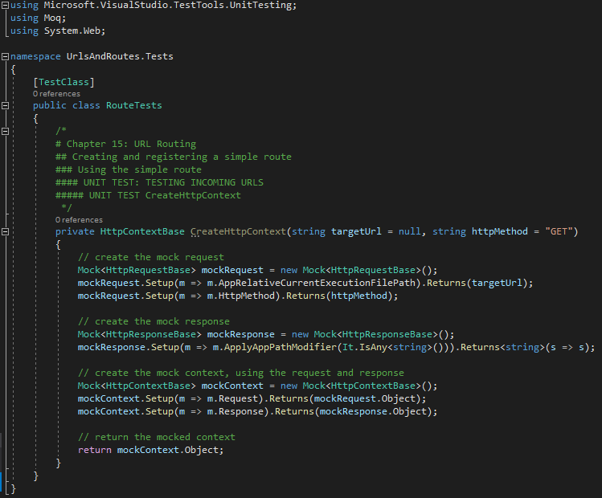
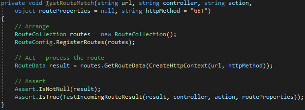
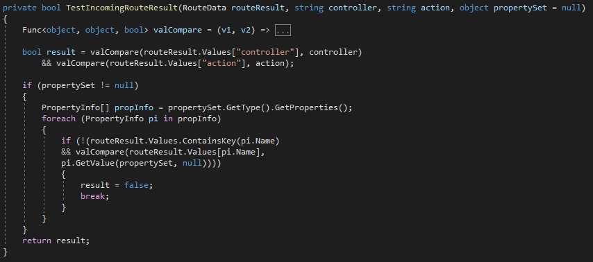
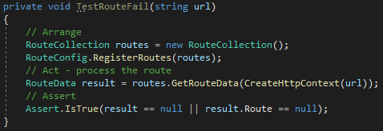
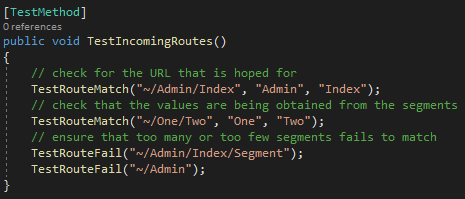

# Chapter 15: URL Routing

## Creating and registering a simple route  

Once a *URL pattern* is chosen, the route will be defined. Routes are defined in the static method called *RegisterRoutes*, in the *RouteConfig* class, as seen in Listing 15-5.

     
    <b>Listing 15-5.</b> The Default contents of the RouteConfig.cs file

  

The *RegisterRouter* method (*RouteConfig class*) is called in the *Global.asax.cs* file through the Application_Start method in the *MvcApplication* class, as seen in Listing 15-6. In the *MvcApplication* class, the main tasks are configured when the application starts.

     
    <b>Listing 15-6.</b> The Defaiult Contents of the Global.asax.cs file

  

To create a route using **Add** method (RouteCollectin class) follow these two steps:

1. Open the *RouteConfig.cs* file and remove all instructions.
2. Now, edit the *RouteConfig.cs* file to match as seen in Listing 15-7.

     
    <b>Listing 15-7.</b> Registering a route in the RouteConfig.cs file

  

Use the *MapRoute* method (RouteCollection class) is a better way to register routes. As seen in Listing 15-8, *MapRoute* method has the same effect and a cleaner syntax.

     
    <b>Listing 15-8.</b> Registering a Route using the MapRoute method in the RouteConfig.cs file

  

### Using the simple route

An error can be seen when you try to run the application using the root URL, but if you type *"/admin/Index"* in the URL, it will match the **{controller}/{action}** pattern as seen in Figure 15-4.

     
    <b>Figure 15-4.</b> Navigating using a simple route

  

The route in *Listing 15-8* only support a single, specific URL pattern, but does not respond to requests for the root URL. In this chapter, we will see how to build complex routes and patterns.

#### UNIT TEST: TESTING INCOMING URLS

There are two reasons to use Unit Test on Routes:

1. Make sure if the URL schemas is processing as expected.
2. In large applications, check if the complex URL schemes are creating unxpected results.

Unlike previous chapters, multiple tests will be created in a single method with some helper methods

To test the routes, it is necessary to *Mock* three classes: *HttpRequestBase*, *HttpContextBase* and *HttpResponseBase*. Together, these classes recreate enough of the MVC infrastructure to support the routing system.

* To get started follow these steps:

1. Create a new *Unit Test* file called *RouteTests.cs* in *UrlsAndRoutes.Tests* project.
2. Create the mock *HttpContextbase* object, as follow

     

  

* My next helper method lets me test a route:

     

  

* Here is the TestIncomingRouteResult method:

     

  

* A method is also needed to check that a URL does not work. As you will see, this can be an important part of defining a URL schema.

     

  

* Here is a test method that tests the route defined in Listing 15-8.

     

  

[<BACK](https://github.com/deyran/asp-dot-net-training/blob/main/pro-asp-net-mvc/chapter-15/bb-introducing-url-patterns.md) - [NEXT>](https://github.com/deyran/asp-dot-net-training/blob/main/pro-asp-net-mvc/chapter-15/ee-defining-default-values.md)

<!--
##### UNIT TEST TestIncomingRoutes

> SUMMARRY AND UPDATE ==========================
.
> CONTENTS =====================================
# Chapter 15: URL Routing
## Creating and registering a simple route
### Using the simple route
.
> GITHUB =====================================
https://github.com/deyran/asp-dot-net-training/blob/main/pro-asp-net-mvc/chapter-15/dd-creating-and-registering-a-simple-route.md
.
> # ==========================================
#DotNet #csharp #csharpdotnet #dotnetcore #csharpdeveloper #dotnetdevelopers #aspnetcore #ASPNET #aspdotnet #IT #developer #TI #tecnologia #DevOps #desenvolvedor #programador #software #homeoffice #dev #tecnologiadainformacao #devs #code #programacao #programação #tecnologiadainformação #sistemasdeinformação #engenhariadesoftware #GitHub #ASPNETMVC #ASPNET #MVC #core #MVC #route #urlroute #urlroting #urlpatterns #RoutingSystem
-->